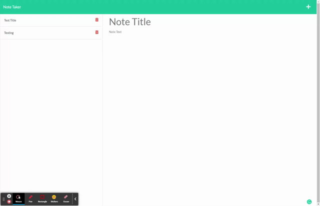

# Project Title

This project allows the user to write, save, and delete notes. It utilizes Express.js to handle the back end and will save and retrieve note data from a JSON file. More specifically, I equip the server to listen for requests sent by the client, and then the respective actions will take place wheter its adding, deleting, or saving a note.

### Demo

## Built With

* [HTML](https://developer.mozilla.org/en-US/docs/Web/HTML)
* [CSS](https://developer.mozilla.org/en-US/docs/Web/CSS)
* [Javascript](https://developer.mozilla.org/en-US/docs/Web/JavaScript)
* [NodeJS](https://nodejs.org/en/)
* [Express.js](https://expressjs.com/)

## Deployed Link

* [See Live Site](https://frozen-inlet-31695.herokuapp.com/notes)

## Authors

* **David Chou** 

- [Link to Portfolio Site](https://dazedchou.github.io/Updated-Portfolio)
- [Link to Github](https://github.com/dazedchou)
- [Link to LinkedIn](https://www.linkedin.com/in/davidchou99)

## License

This project is licensed under the MIT License 

